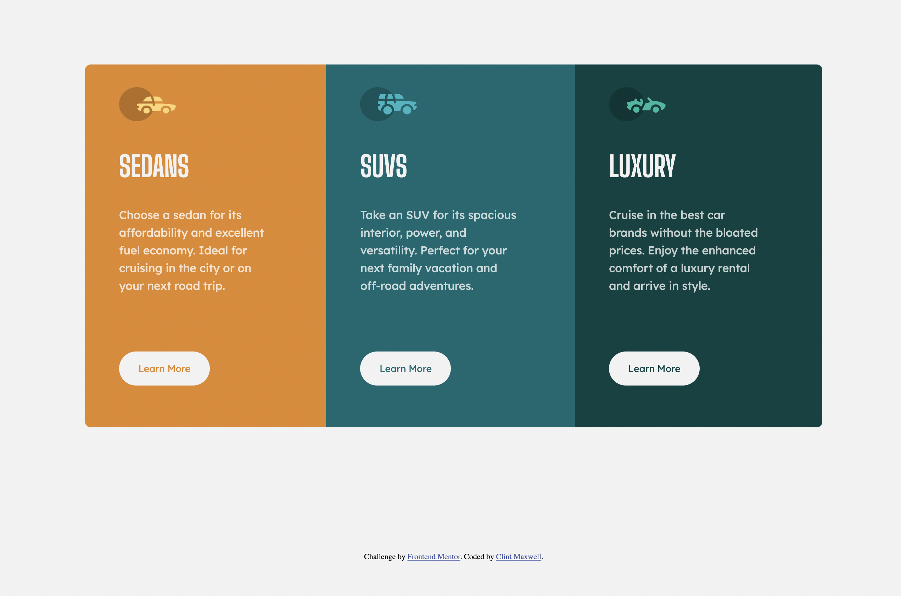
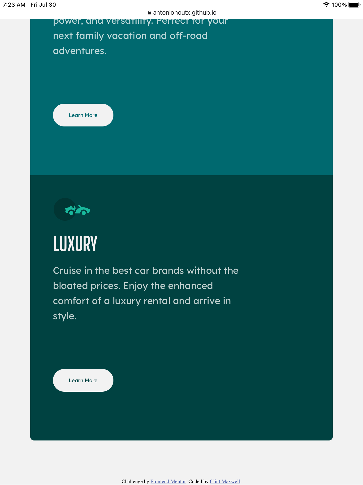
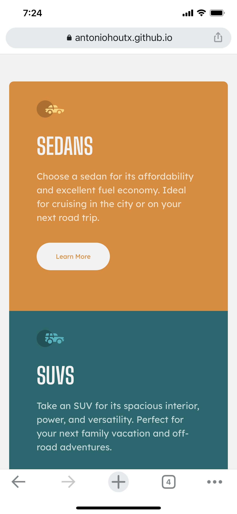
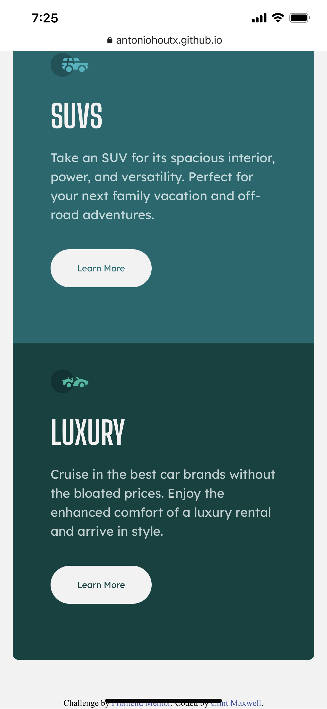

# Frontend Mentor - 3-column preview card component solution

This is a solution to the [3-column preview card component challenge on Frontend Mentor](https://www.frontendmentor.io/challenges/3column-preview-card-component-pH92eAR2-). Frontend Mentor challenges help you improve your coding skills by building realistic projects. 

## Table of contents

- [Overview](#overview)
  - [The challenge](#the-challenge)
  - [Screenshot](#screenshot)
  - [Links](#links)
- [My process](#my-process)
  - [Built with](#built-with)
  - [What I learned](#what-i-learned)
  - [Continued development](#continued-development)
  - [Useful resources](#useful-resources)
- [Author](#author)
- [Acknowledgments](#acknowledgments)

## Overview

### The challenge

Users should be able to:

- View the optimal layout depending on their device's screen size
- See hover states for interactive elements

### Screenshot

#### Desktop Version



#### Tablet Version (Top & Bottom)




#### Mobile Version (Top & Bottom)




### Links

- Solution URL: [3 Column Preview Card Component Main Solution](https://www.frontendmentor.io/solutions/responsive-web-site-using-css-grid-KmLnsvlWf)
- Live Site URL: [3 Column Preview Card Component Main Site](https://antoniohoutx.github.io/3-column-preview-card-component-main/)

## My process

### Built with

- Semantic HTML5 markup
- CSS custom properties
- Flexbox
- Mobile-first workflow

### What I learned

In the beginning as I was working on this project, I was still a bit forgetful regarding the margins and padding of this project and how to get the final website to look just "right".  As shown in the code snippet below, I continued to tweak the various properties in CSS of the parent container and the child containers until I was satisfied with what was created.


```css
.main {
    flex-direction: row;
    max-width: 75rem;
    height: 36rem;
    margin: 7rem;
    padding: 0rem 5rem;
  }
```


### Continued development

My continued development in CSS will focus on the box model and how the margins and padding interact with each other in a container element.

### Useful resources

- [The W3 Reference Guide (CSS)](https://www.w3schools.com/cssref/default.asp) - As always, the "go-to" resource for all things CSS related.  This proved invaluable in developing this project.

## Author

- Frontend Mentor - [@AntonioHouTX](https://www.frontendmentor.io/profile/AntonioHouTX)
## Acknowledgments

As always, I'd like to thank the team at Slack for providing me with valuable feedback and encouragement on this project.  I would also like to especially thank [Drull](https://github.com/drull1000) for his time and patience in assisting me with this project.


